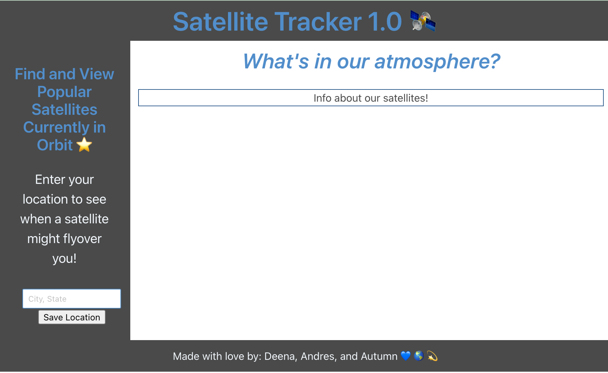

# Satellite Tracker 1.0
## A Group 8 Project 🌎

For the first project of this bootcamp, our group decided to build a satellite tracker. We designed this site with a specific User Story in mind, one that centered around astrophotography. Based on that, we built a site that showcases 4 of the most popular space objects orbiting Earth. Not only that, we were also able to utilize users' locations through their own input in order to predict when a particular satellite might flyover them! Paired with N2YO's REST API, we also implemented NASA's APOD API to provide pictures and inspiration for the astrophotographers visiting our site.

### The following shows the languages used for this project:
* HTML
* CSS
* javaScript
* Bulma CSS Framework

### Preview of Our Work 🌟

#### Contributors 💙
* Andres Garza
* Deena Smith
* Autumn Yarborough-Cain

#### Credits ✨
* [N2YO REST API](https://www.n2yo.com/api/)
* [NASA APOD API](https://api.nasa.gov/)